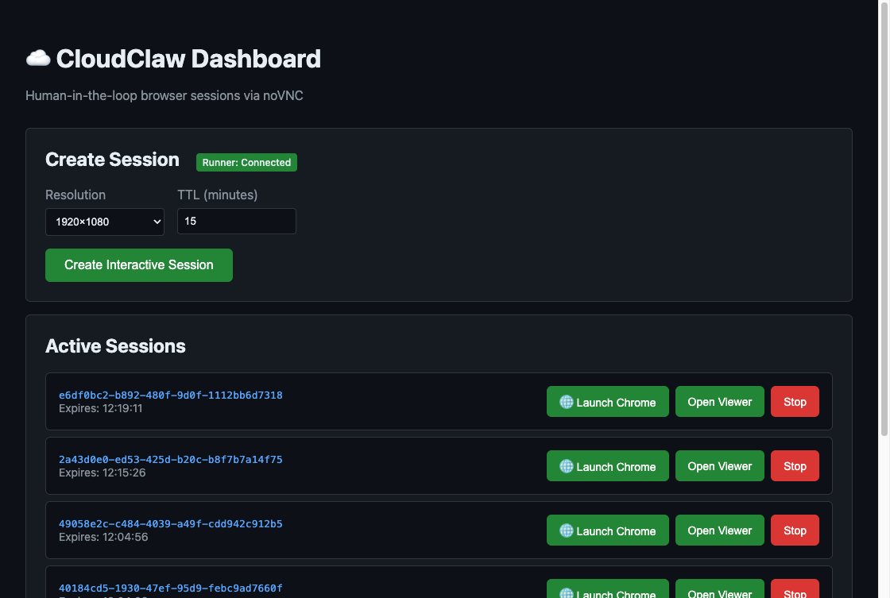
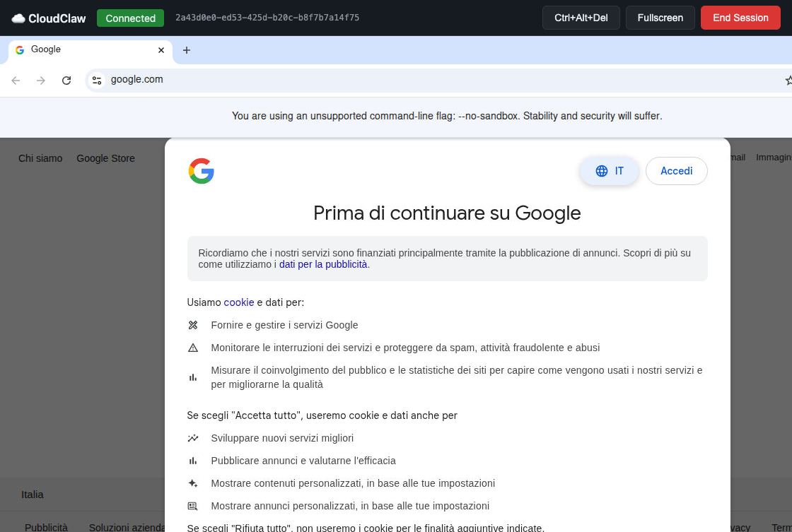

# CloudClaw

Open source gateway to deploy and manage OpenClaw in the cloud with human-in-the-loop browser sessions via noVNC.

## Screenshots

### Dashboard
Create and manage browser sessions from the web dashboard:



### noVNC Viewer
Control Chrome remotely through the browser:



## Features

- **🦀 Fleet Management**: Deploy and manage multiple OpenClaw instances with ocean-themed names
- **🖥️ Multi-Machine**: Register remote servers via SSH and deploy instances across machines
- **🌐 Browser Sessions**: Create isolated Chrome sessions with VNC access per instance
- **🔗 Instant Sharing**: Share any local port via Cloudflare Quick Tunnels (no account needed)
- **👁️ Live Viewer**: Control the browser in real-time via noVNC
- **⏱️ Auto-Cleanup**: Sessions and tunnels auto-expire after TTL

## What is CloudClaw?

CloudClaw is a fleet manager for OpenClaw instances. Deploy multiple AI agents to the cloud and manage them from a single dashboard.

**Key capabilities:**
- **VPS Provisioning**: Deploy to Hetzner or DigitalOcean with one command
- **Full Stack Setup**: Node.js, Chrome, OpenClaw, cloudflared — all automated
- **Visual Browser Sessions**: View and control Chrome via noVNC when needed
- **Human-in-the-Loop**: When Playwright hits a login page, users can manually authenticate
- **Instant Sharing**: Expose any port via Cloudflare Quick Tunnels

```
┌─────────────────────────────────────────────────────────────────┐
│                    CloudClaw Dashboard                          │
│  🦀 pacific-octopus [running]    + Session    Delete           │
│  🦀 coral-lobster   [running]    + Session    Delete           │
│  🦀 reef-kraken     [stopped]    Start        Delete           │
└─────────────────────────────────────────────────────────────────┘
                              │
           ┌──────────────────┼──────────────────┐
           ▼                  ▼                  ▼
    ┌─────────────┐    ┌─────────────┐    ┌─────────────┐
    │   Runner    │    │   Runner    │    │   Runner    │
    │  (Hetzner)  │    │   (DO)      │    │  (Local)    │
    └─────────────┘    └─────────────┘    └─────────────┘
```

## Ocean-Themed Names 🦀

Every CloudClaw instance gets a unique ocean-themed name combining an adjective with a sea creature:

**Adjectives:** salty, coral, reef, tidal, deep, pacific, stormy, misty, azure, pearl, sandy, tropical, arctic, atlantic, calm, foamy, briny, coastal, abyssal, pelagic

**Creatures:** hermit, lobster, kraken, shrimp, crayfish, nautilus, urchin, barnacle, crab, prawn, krill, squid, octopus, starfish, clam, mussel, oyster, scallop, conch, mantis

**Examples:** `salty-hermit`, `coral-lobster`, `reef-kraken`, `pacific-octopus`, `deep-nautilus`

## Quick Start

### Install CLI

```bash
npm install -g cloudclaw
```

### Deploy Your First Instance

```bash
# Create a new instance (auto-generates ocean name)
cloudclaw new
# > Instance name: (abyssal-kraken)  ← press enter to accept

# Deploy to cloud
cloudclaw deploy

# Open dashboard
cloudclaw dashboard

# View logs
cloudclaw logs -f
```

### Multi-Instance Workflow

```bash
# List all instances
cloudclaw list
# 🦀 Instances
#   🟢 salty-hermit
#      hetzner • 5.78.123.45 • ts:100.64.1.2
#      deployed 2h ago
#
#   🔵 coral-lobster
#      digitalocean • 64.23.1.1
#      deploying...

# Commands work without name (interactive picker)
cloudclaw status    # prompts if multiple instances
cloudclaw ssh       # prompts if multiple instances
cloudclaw logs      # prompts if multiple instances

# Or use partial name matching
cloudclaw ssh hermit        # matches "salty-hermit"
cloudclaw status coral      # matches "coral-lobster"
cloudclaw logs kraken       # matches "abyssal-kraken"

# Full name also works
cloudclaw destroy salty-hermit
```

## CLI Commands

| Command | Description |
|---------|-------------|
| `cloudclaw new` | Create a new instance (auto-generates ocean name) |
| `cloudclaw deploy [name]` | Deploy instance to VPS |
| `cloudclaw status [name]` | Show instance status |
| `cloudclaw list` | List all instances |
| `cloudclaw ssh [name]` | SSH into an instance |
| `cloudclaw logs [name]` | View OpenClaw logs |
| `cloudclaw dashboard [name]` | Open the OpenClaw dashboard |
| `cloudclaw destroy [name]` | Destroy an instance |

**Note:** When `[name]` is omitted:
- If only one instance exists, it's auto-selected
- If multiple exist, an interactive picker appears
- Partial names work: `hermit` matches `salty-hermit`

## Remote Machines 🖥️

CloudClaw can manage OpenClaw instances on remote servers via SSH:

1. Click **"+ Add Remote Machine"** in the dashboard
2. Enter the server details:
   - Name (e.g., `my-hetzner-box`)
   - Host (IP or hostname)
   - SSH port (default: 22)
   - Username (default: root)
   - SSH private key or password
3. Test the connection
4. Select the machine when deploying new instances

**Requirements for remote machines:**
- Docker installed
- SSH access (key or password)
- Ports 8080 and 7900-7920 available

## What Gets Installed

On each VPS, CloudClaw installs:
- 4GB swap (for low-memory servers)
- Node.js LTS (via NVM)
- Google Chrome
- OpenClaw
- Display stack: Xvfb, x11vnc, websockify, noVNC
- Cloudflared (for sharing tunnels)
- Tailscale (optional, for secure remote access)
- systemd service for OpenClaw

## Cloud Providers

### Hetzner Cloud
- Cheapest: CPX11 (2 vCPU, 2GB RAM) at €4.35/mo
- US locations: Ashburn, Hillsboro
- EU locations: Falkenstein, Nuremberg, Helsinki

### DigitalOcean
- Smallest: s-1vcpu-2gb (1 vCPU, 2GB RAM) at $12/mo
- Regions: NYC, SFO, AMS, LON, FRA, SGP

## Architecture

### Dashboard (Fleet Manager)
Central control panel for all your OpenClaw instances:
- **Instance Management**: Create, monitor, and delete instances
- **Session Control**: Create browser sessions on any instance
- **WebSocket Proxy**: Secure VNC connections through the dashboard
- **Tunnel Management**: Create and manage Cloudflare tunnels

### Runner Agent
Runs on each VPS. Manages interactive browser sessions:
- Creates on-demand display sessions (Xvfb + Chrome + x11vnc)
- Launches Chrome with Playwright
- Exposes private HTTP API for session management
- Creates cloudflared tunnels for port sharing
- Auto-cleanup on TTL expiry

### API Endpoints

**Machines:**
- `GET /api/machines` - List all machines
- `POST /api/machines` - Add remote machine (with SSH credentials)
- `GET /api/machines/:id` - Get machine details
- `POST /api/machines/:id/test` - Test SSH connection
- `GET /api/machines/:id/runner-status` - Check if runner is running
- `POST /api/machines/:id/start-runner` - Start runner via SSH
- `DELETE /api/machines/:id` - Remove machine

**Instances:**
- `GET /api/instances` - List all instances
- `POST /api/instances` - Create new instance
- `GET /api/instances/:id` - Get instance details
- `DELETE /api/instances/:id` - Delete instance

**Sessions (per instance):**
- `POST /api/instances/:id/sessions` - Create session on instance
- `GET /api/instances/:id/sessions` - List sessions for instance
- `POST /api/sessions/:id/chrome` - Launch Chrome in session
- `POST /api/sessions/:id/stop` - Stop session

**Tunnels:**
- `POST /api/sessions/:id/tunnels` - Create tunnel (expose port)
- `GET /api/sessions/:id/tunnels` - List tunnels
- `DELETE /api/sessions/:id/tunnels/:port` - Stop tunnel

## Sharing (Tunnels)

CloudClaw includes built-in support for sharing local ports via Cloudflare Quick Tunnels:

1. Click **🔗 Share** on any session
2. Enter the local port to expose (e.g., 3000 for a dev server)
3. Get an instant public URL like `https://random-name.trycloudflare.com`

**No Cloudflare account required** — uses Cloudflare's free Quick Tunnels feature.

Tunnels are automatically cleaned up when the session ends.

## Security

- VNC/WebSocket ports bind only to private interface
- Firewall allows only dashboard to connect to runner
- Dashboard is the only public entrypoint (HTTPS)
- Per-session access control (owner only)
- Sessions auto-expire after TTL (default 15 minutes)
- Tailscale for secure remote access (optional)

## Development

### Docker (Recommended)

The easiest way to run CloudClaw locally:

```bash
# Clone repo
git clone https://github.com/buddybot89/cloudclaw
cd cloudclaw

# Start with Docker Compose
docker-compose up -d

# Dashboard available at http://localhost:3000
# Runner API at http://localhost:8090
```

### Manual Setup

```bash
# Install CLI dependencies
cd cli && npm install

# Run CLI locally
node bin/cloudclaw.js new

# Run runner agent (on Ubuntu with display stack)
cd runner-agent && npm install && npm start

# Run dashboard
cd middle-server && npm install && npm start
```

### What's in the Docker Stack

- **cloudclaw-runner**: Ubuntu 24.04 + Xvfb + x11vnc + websockify + Playwright Chrome + cloudflared
- **cloudclaw-dashboard**: Node.js dashboard with SQLite for instance/session storage

## License

MIT

## Credits

Inspired by [ClawControl](https://github.com/ipenywis/clawcontrol) by Islem.
